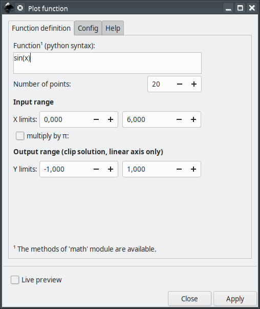
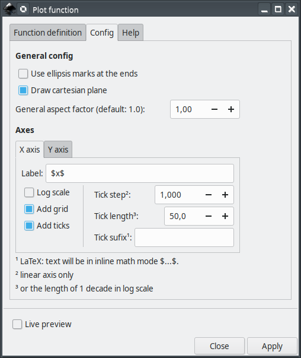

# cartesianPlotFunction2D

This extension will assist you creating plot of functions of independent variable in [Inkscape](https://inkscape.org/).


This extension was inspired by Tavmjong Bah's (and collaborators) extension **Function Plotter** already presented in Inkscape. Function Plotter extension is not required here.

### main features

The main features are

 - Linear and log10 scales
 - Optional grid lines in X and Y directions
 - Adjustable tick mark intervals and sizes
 - Optional LaTeX support

## Current and older versions

Compatibility table

|  Inkscape        |  cartesianPlotFunction2D | inkscapeMadeEasy | Receive updates?|
|------------------|-----------------|------------------|-----------------|
|       1.0        | 1.0 (latest)    |   1.0 (latest)   | YES             |
| 0.48, 0.91, 0.92 | 0.9x (obsolete) |  0.9x (obsolete) | NO              |


**Latest version:** The latest version of **cartesianPlotFunction2D** is **1.0**. This version is compatible with Inkscape 1.0 and up only. It is **incompatible** with older Inkscape versions!

**Older versions:** If you have an older version of Inkscape, please use the files under the folder **0.9x** on Github.

**Important: Only the latest version will receive updates, new features, and bug fixes! The usage section in this documentation describes the latest version. In older versions, the disposition of the elements in the plugin's screen might be different. Some features might not be present or have different behavior.**

# Installation and requirements

Installation procedures for latest and older versions are described below.

## Requirements (all versions)

- You will need [inkscapeMadeEasy](https://github.com/fsmMLK/inkscapeMadeEasy) plugin installed. Check the compatibility table above to know the version you need.

## Installation procedure (v1.0 only)

**cartesianPlotFunction2D** was developed using Inkscape 1.0 in Linux (Kubuntu 18.04). It should work in different OSs too as long as all requirements are met.

1. Install [inkscapeMadeEasy](https://github.com/fsmMLK/inkscapeMadeEasy), **version 1.0** (latest). Follow the instructions in the manual page. **Note:** LaTeX text is used in **cartesianPlotFunction2D** if the support is activated (nicer results), otherwise regular text elements will be used.

2. **cartesianPlotFunction2D** installation

    1. Go to Inkscape's extension directory with a file browser. Your inkscape extension directory can be accessed by opening Inkscape and selecting ``Edit > Preferences > System``. Look for the item **User Extensions**  field. There is a button on the right of the field  that will open a file explorer window in that specific folder.

    2. Create a subfolder in the extension directory with the name ``cartesianPlotFunction2D``. **Important:**  Be careful with upper and lower case letters. You must write as presented above.

    3. Download **cartesianPlotFunction2D** files and place them inside the directory you just created.

       You don't have to copy all files from Github. The files you will need are inside the ``latest`` folder. In the end you must have the following files and directories in your Inkscape extension directory.

       **LaTeX users:** You can add macros to ``inkscapeMadeEasy/basicLatexPackages.tex``. In this case the same macros will be accessible by all plugins that employ inkscapeMadeEasy.

        ```
        inkscape
         ┣━━extensions
         ┋   ┣━━ inkscapeMadeEasy      <-- inkscapeMadeEasy folder
             ┃    ┣━━ inkscapeMadeEasy_Base.py
             ┃    ┣━━ inkscapeMadeEasy_Draw.py
             ┃    ┣━━ inkscapeMadeEasy_Plot.py
             ┃    ┗━━ basicLatexPackages.tex
             ┃
             ┣━━ textext               <-- texText folder (if you installed textText)
             ┃    ┋
             ┃
             ┣━━ cartesianPlotFunction2D        <-- cartesianPlotFunction2D folder
             ┋    ┣━━ cartesianPlotFunction2D.inx
                  ┗━━ cartesianPlotFunction2D.py
        
        NOTE: You might have other sub folders inside the extensions directory. They don't interfere with the plugin.
        ```

## Installation procedure (v0.9x only)

**cartesianPlotFunction2D** was developed using Inkscape 0.48 and 0.91 in Linux (Kubuntu 18.04). It should work in different OSs too as long as all requirements are met.

1. Install [inkscapeMadeEasy](https://github.com/fsmMLK/inkscapeMadeEasy), **version 1.0** (latest). Follow the instructions in the manual page. **Note:** LaTeX text is used in **cartesianPlotFunction2D** if the support is activated (nicer results), otherwise regular text elements will be used.

2. **cartesianPlotFunction2D** installation

    1. Go to Inkscape's extension directory with a file browser.

    2. Download **cartesianPlotFunction2D** files and place them inside the directory you just created.

       You don't have to copy all files from Github. The files you will need are inside the ``0.9x`` folder. In the end you must have the following files and directories in your Inkscape extension directory.

        ```
        inkscape
         ┣━━ extensions
         ┋    ┣━━ inkscapeMadeEasy_Base.py
              ┣━━ inkscapeMadeEasy_Draw.py
              ┣━━ inkscapeMadeEasy_Plot.py
              ┃
              ┣━━ textextLib
              ┃    ┣━━ __init__.py
              ┃    ┣━━ basicLatexPackages.tex
              ┃    ┣━━ textext.inx
              ┃    ┗━━ textext.py
              ┃
              ┣━━ cartesianPlotData2D.inx        <--   from repository folder 0.9x!
              ┗━━ cartesianPlotData2D.py         <--
        ```

# Usage

The extension can be found under `extensions > fsmMLK > Plot 2D > Cartesian` menu.

This extension is presented in two tabs, **Function Definition** and  **Axes configuration**. The first is used to define the function and input/output ranges. The second is used to configure the axes.

## Function Definition tab



Here you can define your function and set both the input and output ranges. 

**Function:** Function definition. This must be a python compatible expression. Your independent variable **MUST** be `x`.

> Tip: This extension imports all method from 'math' module from python. Therefore you don have to specify the module name math.[some_method]. Example: to generate a sine function, just type `sin(x)`. You don't have to type `math.sin(x)`

> Important: The extension will execute the function as a piece of python code. **DO NOT copy paste functions from untrusted sources!**

### General config section

**Number of points:** Number of points where the function will be evaluated within the limits. See image below.

  - *X axis in linear scale*: the points will be uniformly distributed within the limits.
  - *X axis in log scale*: the points will be logarithmically distributed within the limits (same number of points per decade)


**Use ellipsis marks at the ends:** Use ellipsis marks at the end of the plots to indicate continuation


**Draw Cartesian plane:** Toggle to generate the cartesian axes together with the plot.


**General aspect factor:** General aspect ratio between line widths and text height. I designed this extension to have an overall aspect ratio that "looks nice". It is a function of X and Y tick lengths. With this control you can scale both line width and text height. The defauls value is 1.0.


### Input/Output range sections

**X limits:** Set the range of the independent variable (X axis). On the side there are two fields for the lower and upper limits.


The extension will inform if these limits are invalid.
  
  - The upper limit must be greater than the lower limit.
  - If logarithmic scale is checked, then the lower limit will be rounded down to the nearest power of 10 and the upper rounded up to the nearest power of 10 in order to complete the decades. Ex: 0.2 to 12, then the limits will be rounded to 0.1 to 100 (see image below). **Attention:** The rounding will not change the range of values in which the function will be evaluated. The limits will be rounded only to present complete decades.
  - If logarithmic scale is checked:
    * if lower limit is smaller or equal to zero then the lower limit will be set to 0.001.
    * if upper limit is smaller or equal to zero then the upper limit will be set to 100 times the lower limit.


**multiply X by pi:** Multiply the limits by pi. Ex: `xMin=-2` and `xMax=2`, with this checkbox selected will result in `xMin=-2pi` ans `xMax=2pi`. This is specially useful for trigonometric functions.

>  If this checkbox is selected, *X tick step* (see below) will also be multiplied  by pi.


**Y limits:** (linear scale only) Set the range of the dependent variable (Y axis). The extension will inform if these limits are invalid. These limits are used to truncate the solution, that is, if `f(x)` does not lie within Ymin and Ymax, the solution will be clipped at these values. See image bellow.

## Axes Configuration tab

This tab has two sections, one for each axis. They affect the axes the same way.


**Label:** label of the axes. If LaTeX support is activated and you want to write in mathematical environment, enclose your text with $...$.

> Tip: Since `siunitx` package is included in inkscapeMadeEasy's basicLatexPackages.tex, you can use any unit command available there too!

> Ex: `Foobar $\sqrt{x^2}$ so fancy! (\si{\newton\per\squaremetre})`


**Log scale:** Set the axis to be represented in log10 scale.

**Add grid:** Draw grid lines.

   - *linear scale:* The grid lines will be placed at the tick marks.
   - *log scale:* The grid lines will be placed dividing each decade in 10 parts

**Add ticks:** Draw tick marks with associated values. 

**Tick step:** Tick mark interval, in units of your chart. This option does not affect log scale.

Ex: limits from -1 to 1, with tick step of 0.5 will produce ticks at -1, -0.5, 0, 0.5, 1

> Note: The ticks will radiate from the origin (x=0 or y=0) unless the origin does not lie within the limits. In such cases, the ticks will radiate starting from the limit closest to the origin. See image below.
>
> Examples in x direction: (The same rules apply to Y direction)
>
> 


**Tick length** The distance between tick marks, in units of your canvas. See image below.

   - *linear scale:* The distance between consecutive ticks, in units of your canvas.
   - *logarithmic scale:* The size of each decade, in units of your canvas.


**Tick suffix:** Optional extra suffix to be added to tick text. **LaTeX support enabled**: You can use any LaTeX text/commands valid in mathematical environment. You don't have to enclose your text between $...$.

**Atention**: the values appended to tick mark text will NOT affect input/output limits!

 

# Observations

 - The plot is generated by evaluating the function at points along the input range and connecting them with a polyline. Therefore if your function has discontinuities, your plot will present a line connecting both sides of the discontinuity. **In such cases, please check your plot!**  ;)


 - The axes will be placed crossing the origin (0,0) or crossing the coordinate (x,y) closest to the origin if the origin does not lies within the limits.
 - The axes will be created in the center of your screen.

# Special functions

Together with the extension, I also predefined 3 new functions:

 - **Heaviside step function**

Calling: `u(x)`

Examples:


 - **Rectangular pulse**

Calling: `rectPulse(x,amplitude=1.0,length=1.0,offset=0.0,delay=0.0)`


 - **Square wave**

Calling: `squareWave(x,amplitude=1.0,offset=0,period=1.0,delay=0.0)`


> Tip: You can define your own functions at the beginning of the file `cartesianPlotFunction2D.py`


